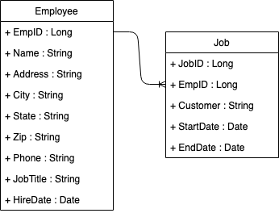

# Employee DB

## Introduction
You have been hired by a large staffing agency (Coders4Hire) to make modifications to their existing employee database application.  Right now the application holds some basic information on the employee, but it doesn't have any information on their work history. The current fields that it keeps track of are:
* name
* address
* city
* state
* zip
* phone number
* job title
* date hired

The application you'll be working on is the REST API that manages requests for information from the database.  There is a separate web applciation that calls this API, but there's another team working on that.

## The Ask...
Coders4Hire would like you to modify the API so that it can track work history for each employee.

The formal stories and acceptance criteria are shown below.  But the main thinking is that there will be a new work history entity that will have a one to many relationship with the employee entity that already exists.



### Story and Acceptance Criteria

```cucumber
As an API client 
I need to be able to perform CRUD operations on a Job table that has a one to many relationship with Employees 
so that I can track an employee's job history.

Given that an employee with EmpID==1 
When a post call is made to http://localhost:8080/job/add/
where the payload includes {jobID:2, EmpID:1, Customer:"Cust1", StartDate:"2018-10-25", EndDate:"2018-11-16"}
Then I should receive a 200 message and the new job should be serialized to the database.

Given that an employee with EmpID==1 and a job with JobID==2
When a get call is made to http://localhost:8080/job/get/2
Then I should receive a 200 message and a payload that includes {jobID:2, EmpID:1, Customer:"Cust1", StartDate:"2018-10-25", EndDate:"2018-11-16"}

Given that an employee with EmpID==1 and a job with JobID==2
When a put call is made to http://localhost:8080/job/put/2
where the payload includes {jobID:2, Customer:"Cust2"}
Then I should receive a 200 message and a payload that includes {jobID:2, EmpID:1, Customer:"Cust2", StartDate:"2018-10-25", EndDate:"2018-11-16"}

```

## Notes
* If you feel an acceptance criteria is vague, then please ask the instructor for clarification as XP values human interaction over written requirements.
* Be sure to use test driven design to guide your work. 
* Be sure to commit after each passed test (you are evaluated on the number of commits you make).

## How to submit your work
* Push to your cloned github repository.
* Make a pull request back to the original master.

 
